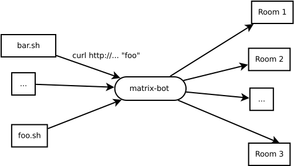

# matrix-bot - post to matrix.org from the command line!

This bot enables you to use curl, wget or any other HTTP client to post messages to [matrix.org](https://matrix.org) channels, without specifying credentials, logging in or joining rooms manually. You can use it to write scripts that publish important information, like service restarts, new mails, ….

## Installation

### Via Docker

The easiest way to install the bot (or just try it out) is via Docker. Just pull the docker image via

    docker run --rm -v ./docs:/etc/matrix-bot:ro -p 1339:1339 plapadoo/matrix-bot
	
This will pull the official image from [Docker Hub](https://hub.docker.com/r/plapadoo/matrix-bot/) and start the container, thus starting the bot. Because the bot needs to log in to matrix, you need to specify a server, a login name and a password. This cannot be done from the command line at the moment – you need a config file. The repository contains a sample config file in the `docs/` directory.

The bot will immediately try to log in to matrix and tell you if that worked.

The sample config file makes the bot listen on port 1339 and the command line above publishes this port to 1339 on the host.

### Manually

Assuming you have compiled the bot yourself, you’re left with a single executable file:  `matrix-bot-exe`. Without command line arguments, the bot assumes that there’s a configuration file in `/etc/matrix-bot/matrix-bot.dhall`, though you can override this using `--config-file` on the command line.

## Compilation from source

### Using Nix

The easiest way to compile the bot or the docker image from source is to use the [nix package manager](https://nixos.org/nix/). With it, you can build the bot using

    nix-build
	
The resulting files will be located in the `result/` directory. To build the Docker image, use

    nix-build dockerimage.nix
	
This will, at the last line, output a path that you can feed into `docker load`.

### Using cabal

The bot can be compiled using [cabal-install](https://www.haskell.org/cabal/) by using `cabal install --only-dependencies` and then `cabal install`.

## Configuration

The bot has just a single configuration file, which is written in the [dhall configuration language](https://github.com/dhall-lang/dhall-lang/blob/master/README.md). The format should be self-explanatory. Check out the 

## Usage

The bot listens on a HTTP port (1339 by default). The path specifies the *internal room number* of the room you want to post to. You can query the internal room number by pressing the gear icon on the top left in a room and then scrolling all the way down.

